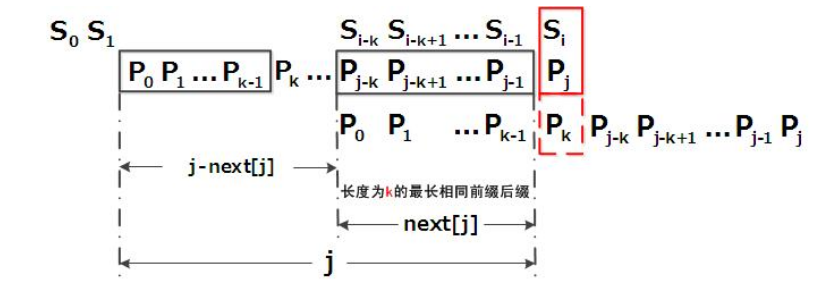

# 字符串匹配算法：KMP

Knuth–Morris–Pratt（KMP）算法是一种改进的字符串匹配算法，

它的核心是利用匹配失败后的信息，尽量减少模式串与主串的匹配次数以达到快速匹配的目的

它的时间复杂度是 O(m+n)


## 解决问题
假设现在我们面临这样一个问题：有一个文本串S，和一个模式串P，现在要查找P在S中的位置，怎么查找呢？


## 常规操作 - 暴力破解法

如果用暴力匹配的思路, 并假设现在文本串S匹配到 i 位置, 模式串P匹配到 j 位置, 则有:

::: tip 算法过程
如果当前字符匹配成功,即<b class="vue-color grey-bg">S[i] == P[j]</b>，则<b class="vue-color grey-bg">i++, j++</b>，继续匹配下一个字符;

如果失配, 即 <b class="vue-color grey-bg">S[i]! = P[j]</b> , 令 <b class="vue-color grey-bg">i = i - (j - 1), j = 0</b>

相当于每次匹配失败时, i 回溯, j 被置为0
:::

具体流程如下：

举个例子:
```python
# 给定文本串
S = "BBC ABCDAB ABCDABCDABDE"
# 模式串
P = "ABCDABD"
```

现在要拿模式串P去跟文本串S匹配, 整个过程如下所示：

1. S[0]为B，P[0]为A:
* S[1]跟P[0]不匹配: <b class="vue-color grey-bg">S[i]! = P[j],令i = i - (j - 1),j = 0</b>
* S[1]跟P[0]匹配: 模式串要往右移动一位 <b class="vue-color grey-bg">i=1, j=0</b>

2. S[1]跟P[0]:
* S[1]跟P[0]不匹配: <b class="vue-color grey-bg">S[i]! = P[j],令i = i - (j - 1),j = 0</b>
* S[1]跟P[0]匹配: 模式串不断的往右移动一位 <b class="vue-color grey-bg">i=2, j=0</b>

3. 直到S[4]跟P[0]匹配成功 <b class="vue-color grey-bg">i=4, j=0</b>
此时按照上面的暴力匹配算法的思路，转而执行第①条指令:

<b class="grey-bg">如果当前字符匹配成功(即S[i] == P[j]), 则i++, j++,可得S[i]为S[5],P[j]为P[1],即接下来S[5]跟P[1]匹配(i=5, j=1)</b>

4. S[5]跟P[1]匹配成功，继续执行第①条指令:

<b class="grey-bg">如果当前字符匹配成功,即S[i] == P[j],则i++, j++, 得到S[6]跟P[2]匹配(i=6，j=2)如此进行下去</b>

5. 直到S[10]为空格字符，P[6]为字符D(i=10，j=6)，因为不匹配，重新执行第②条指令：

<b class="grey-bg">如果失配(S[i]! = P[j]),令i = i - (j - 1), j = 0，相当于S[5]跟P[0]匹配(i=5, j=0)</b>

6. 至此，我们可以看到，如果按照暴力匹配算法的思路，尽管之前文本串和模式串已经分别匹配到了<b class="vue-color">S[9], P[5]</b>

但因为<b class="vue-color">S[10]</b>跟<b class="vue-color">P[6]</b>不匹配，所以文本串回溯到<b class="vue-color">S[5]</b>

模式串回溯到<b class="vue-color">P[0]</b>，从而让<b class="vue-color">S[5]</b>跟<b class="vue-color">P[0]</b>匹配

而<b class="vue-color">S[5]</b>肯定跟<b class="vue-color">P[0]</b>失配。为什么呢？

因为在之前第4步匹配中，我们已经得知<b class="vue-color">S[5] = P[1] = B</b>，

而<b class="vue-color">P[0] = A</b>，

即<b class="vue-color">P[1] != P[0]</b>，

故<b class="vue-color">S[5]</b>必定不等于<b class="vue-color">P[0]</b>，所以回溯过去必然会导致失配。


## KMP算法

Knuth-Morris-Pratt 字符串查找算法，简称为 “KMP算法”，常用于在一个文本串S内查找一个模式串P 的出现位置

下面先直接给出KMP的算法流程：

假设现在文本串S匹配到 <b class="vue-color"> i </b>位置,模式串P匹配到 <b class="vue-color"> j </b> 位置

如果<b class="vue-color">j = -1</b>,或者当前字符匹配成功<b class="vue-color">S[i] == P[j]</b>,都令<b class="vue-color">i++,j++</b>，继续匹配下一个字符;

如果<b class="vue-color">j != -1</b>,且当前字符匹配失败<b class="vue-color">S[i] != P[j]</b>,则令 i 不变, <b class="vue-color">j = next[j]</b>

此举意味着失配时，模式串P相对于文本串S向右移动了<b class="vue-color"> j - next [j]</b>位

换言之，当匹配失败时，模式串向右移动的位数为：失配字符所在位置 - 失配字符对应的next 值,

即移动的实际位数为：<b class="vue-color"> j - next[j]</b>，且此值大于等于1

很快，你也会意识到next 数组各值的含义：代表当前字符之前的字符串中，有多大长度的相同前缀后缀

如果<b class="vue-color"> next [j] = k</b>，代表j 之前的字符串中有最大长度为k 的相同前缀后缀

此也意味着在某个字符失配时，该字符对应的next 值会告诉你下一步匹配中，模式串应该跳到哪个位置（跳到next [j] 的位置）

如果next [j] 等于0或-1，则跳到模式串的开头字符,

若<b class="vue-color"> next [j] = k 且 k > 0 </b>，代表下次匹配跳到j 之前的某个字符，而不是跳到开头，且具体跳过了k 个字符


### 具体步骤

* ①寻找前缀后缀最长公共元素长度

对于P = p0 p1 ...pj-1 pj，寻找模式串P中长度最大且相等的前缀和后缀。

如果存在p0 p1 ...pk-1 pk = pj- k pj-k+1...pj-1 pj，

那么在包含pj的模式串中有最大长度为k+1的相同前缀后缀。

举个例子，如果给定的模式串为“abab”，那么它的各个子串的前缀后缀的公共元素的最大长度如下表格所示：

|  模式串   | a  | b  | a  | b  |
|  ----  | ----  | ----  | ----  | ----  |
| 最大前缀后缀公共元素长度  | 0 | 0  | 1  | 2 |

比如对于字符串aba来说，它有长度为1的相同前缀后缀a；

而对于字符串abab来说，它有长度为2的相同前缀后缀ab（相同前缀后缀的长度为k + 1，k + 1 = 2）

* ②求next数组

next 数组考虑的是除当前字符外的最长相同前缀后缀，

所以通过第①步骤求得各个前缀后缀的公共元素的最大长度后，

只要稍作变形即可：将第①步骤中求得的值整体右移一位，然后初值赋为-1，如下表格所示：

|  模式串   | a  | b  | a  | b  |
|  ----  | ----  | ----  | ----  | ----  |
| next数组  | -1 | 0  | 0  | 1 |

比如对于aba来说，第3个字符a之前的字符串ab中有长度为0的相同前缀后缀，所以第3个字符a对应的next值为0；

而对于abab来说，第4个字符b之前的字符串aba中有长度为1的相同前缀后缀a，

所以第4个字符b对应的next值为1（相同前缀后缀的长度为k，k = 1）

* ③根据next数组进行匹配

匹配失配，j = next [j]，模式串向右移动的位数为：j - next[j]。

换言之，当模式串的后缀pj-k pj-k+1, ..., 

pj-1 跟文本串si-k si-k+1, ..., si-1匹配成功，

但pj 跟si匹配失败时，因为next[j] = k，

相当于在不包含pj的模式串中有最大长度为k 的相同前缀后缀，

即p0 p1 ...pk-1 = pj-k pj-k+1...pj-1，

故令j = next[j]，从而让模式串右移j - next[j] 位，

使得模式串的前缀p0 p1, ..., pk-1对应着文本串 si-k si-k+1, ..., si-1，

而后让pk 跟si 继续匹配。如下图所示：



综上，KMP的next 数组相当于告诉我们：

当模式串中的某个字符跟文本串中的某个字符匹配失配时，模式串下一步应该跳到哪个位置。

如模式串中在j 处的字符跟文本串在i 处的字符匹配失配时，下一步用next [j] 处的字符继续跟文本串i 处的字符匹配，相当于模式串向右移动 j - next[j] 位

### 寻找最长前缀后缀

如果给定的模式串是：“ABCDABD”，从左至右遍历整个模式串，其各个子串的前缀后缀分别如下表格所示：

|  模式串中的各个子串   | 前缀  | 后缀  | 最大公共元素长度 |
|  ----  | ----  | ----  | ----  |
| A  | 空 | 空  | 0  |
| AB  | A | B  | 0  |
| ABC  | A,AB | C,BC  | 0  |
| ABCD  | A,AB,ABC | D,CD,BCD  | 0  |
| ABCDA  | A,AB,ABC,ABCD | A,DA,CDA,BCDA   | 1  |
| ABCDAB  | A,AB,ABC,ABCD,ABCDA | B,AB,DAB,CDAB,BCDAB  | 2  |
| ABCDABD  | A,AB,ABC,ABCD,ABCDA,ABCDAB | D,BD,ABD,DABD,CDABD,BCDABD  | 0  |

也就是说，原模式串子串对应的各个前缀后缀的公共元素的最大长度表为:

|  字符   | A | B | C | D | A | B | D |
|  ----  | ----  | ----  | ----  |  ----  | ----  | ----  | ----  |
| 最大前缀后缀公共元素长度 | 0 | 0  | 0  | 0  | 1 | 2  | 0 |

### 基于《最大长度表》匹配

因为模式串中首尾可能会有重复的字符，故可得出下述结论：

<b class="pink-color grey-bg">
失配时，模式串向右移动的位数为：
已匹配字符数 - 失配字符的上一位字符所对应的最大长度值
</b>

下面，咱们就结合之前的《最大长度表》和上述结论，进行字符串的匹配。

如果给定文本串“BBC ABCDAB ABCDABCDABDE”，和模式串“ABCDABD”，现在要拿模式串去跟文本串匹配，如下图所示：


1. 因为模式串中的字符A跟文本串中的字符B、B、C、空格一开始就不匹配，所以不必考虑结论，直接将模式串不断的右移一位即可，直到模式串中的字符A跟文本串的第5个字符A匹配成功：


1. 继续往后匹配，当模式串最后一个字符D跟文本串匹配时失配，显而易见，模式串需要向右移动。
但向右移动多少位呢？因为此时已经匹配的字符数为6个（ABCDAB），然后根据《最大长度表》可得失配字符D的上一位字符B对应的长度值为2，所以根据之前的结论，可知需要向右移动6 - 2 = 4 位。


3. 模式串向右移动4位后，发现C处再度失配，因为此时已经匹配了2个字符（AB），且上一位字符B对应的最大长度值为0，所以向右移动：2 - 0 =2 位。


4. A与空格失配，向右移动1 位。


5. 继续比较，发现D与C 失配，故向右移动的位数为：已匹配的字符数6减去上一位字符B对应的最大长度2，即向右移动6 - 2 = 4 位。


6. 经历第5步后，发现匹配成功，过程结束。


通过上述匹配过程可以看出，问题的关键就是寻找模式串中最大长度的相同前缀和后缀，

找到了模式串中每个字符之前的前缀和后缀公共部分的最大长度后，便可基于此匹配。

而这个最大长度便正是next 数组要表达的含义

### 根据《最大长度表》求next 数组