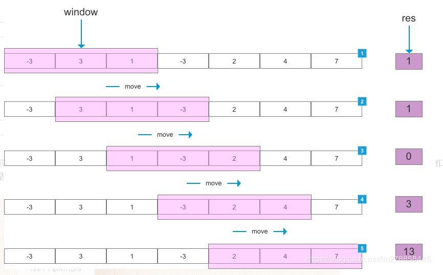

# 滑动窗口类型

### 滑动窗口的概念

滑动的窗口，套在一个序列中，左右的滑动，窗口内就是一个内容集

使用这个<b style="color:#42b983">滑动窗口</b>在数组的<b style="color:#42b983">合法区间</b>内进行滑动，同时<b style="color:#42b983">动态地记录</b>一些有用的数据


### 滑动窗口算法思路

滑动窗口的应用场景有几个特点：

:::tip 1
需要输出或比较的结果在原数据结构中是连续排列的

解决一些查找满足一定条件的连续区间的性质（长度等）的问题。

由于区间连续，因此当区间发生变化时

可以通过旧有的计算结果对搜索空间进行剪枝，这样便减少了重复计算，降低了时间复杂度。
:::

:::warning 2
每次窗口滑动时，只需观察窗口两端元素的变化，无论窗口多长，

每次只操作两个头尾元素，当用到的窗口比较长时，可以显著减少操作次数
:::

:::danger 3
窗口内元素的整体性比较强，窗口滑动可以只通过操作头尾两个位置的变化实现，

但对比结果时往往要用到窗口中所有元素
:::




### 基本思路

1. 序列中使用双指针中的左右指针技巧,<b style="color:#42b983">初始化 left = right = 0</b>,把索引闭区间<b style="color:#42b983">[left, right]</b> 称为一个<b style="color:#42b983">窗口</b>

1. 先不断地<b style="color:#42b983">增加</b><b style="color:#FF1744">right</b>指针扩大窗口[left, right],直到窗口中的子序列符合特定的要求

2. 此时<b style="color:#42b983">停止增加</b> right,转而不断增加<b style="color:#FF1744">left</b>指针<b style="color:#42b983">缩小窗口</b> [left, right],直到窗口中的子序列不再符合要求,同时每次增加 left,我们都要更新一轮结果。

3. 重复第 2 和第 3 步,<b style="color:#42b983">直到 right 到达序列的尽头</b>

这个思路其实也不难,第 2 步相当于在寻找一个<b style="color:#42b983">可行解</b>,然后第 3 步在优化这个可行解,最终找到<b style="color:#42b983">最优解</b>

左右指针轮流前进,窗口大小增增减减,窗口不断向右滑动


## 经典题库

### 连续元素最大和

:::tip 题目
不含有重复字符的 最长子串 的长度
:::

来源：&emsp; [力扣LeetCode](https://leetcode-cn.com/problems/longest-substring-without-repeating-characters/)


```python
class Solution:
    def lengthOfLongestSubstring(self, s: str) -> int:
        # 哈希集合，记录每个字符是否出现过
        occ = set()
        n = len(s)
        # 右指针，初始值为 -1，相当于我们在字符串的左边界的左侧，还没有开始移动
        rk, ans = -1, 0
        for i in range(n):
            if i != 0:
                # 左指针向右移动一格，移除一个字符
                occ.remove(s[i - 1])
            while rk + 1 < n and s[rk + 1] not in occ:
                # 不断地移动右指针
                occ.add(s[rk + 1])
                rk += 1
            # 第 i 到 rk 个字符是一个极长的无重复字符子串
            ans = max(ans, rk - i + 1)
        return ans
```
