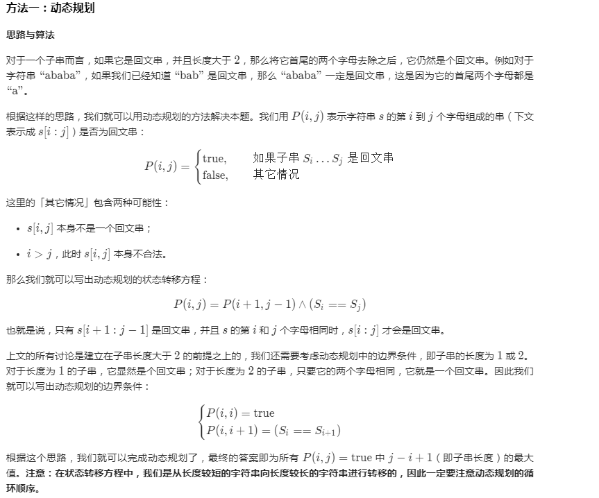
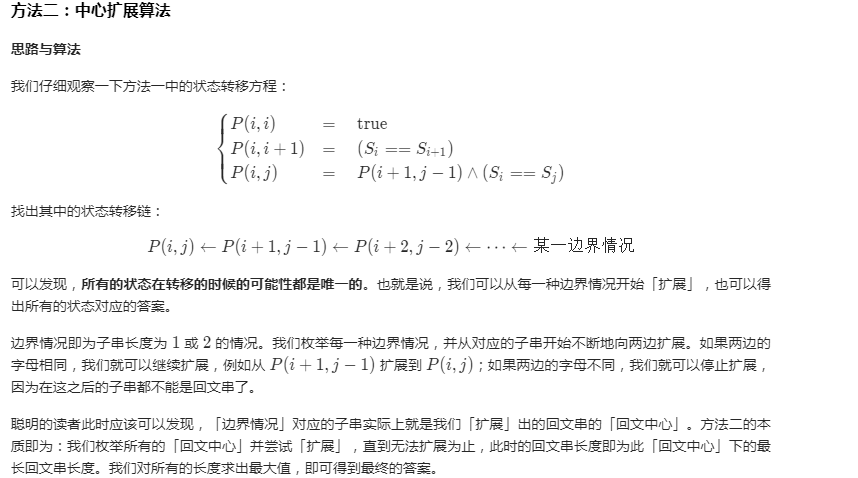
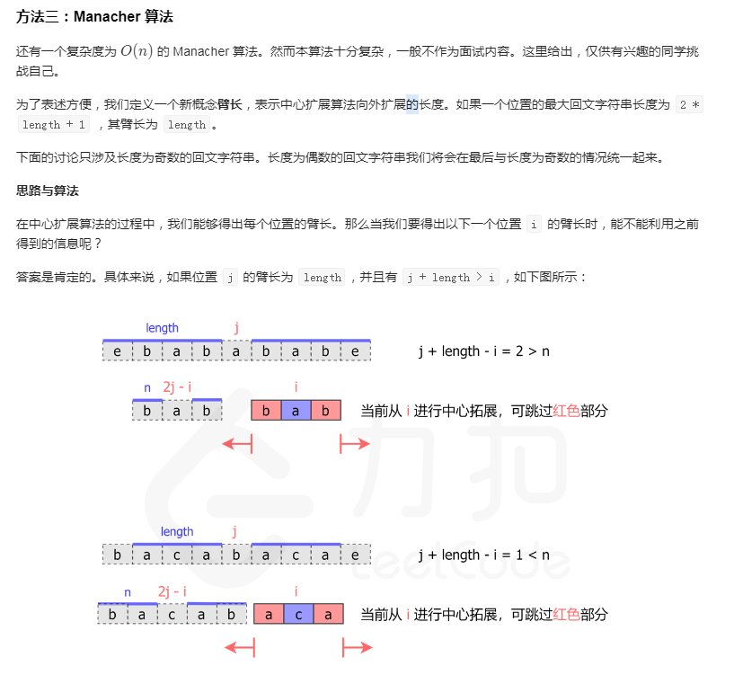

# 最长回文子串

## 算法题

::: tip 题目
给定一个字符串 s，找到 s 中最长的回文子串

你可以假设 s 的最大长度为 1000
:::

~~~
示例1：
    输入: "babad"
    输出: "bab"
    注意: "aba" 也是一个有效答案。
~~~

~~~
示例2：
    输入: "cbbd"
    输出: "bb"
~~~

来源：&emsp; [力扣LeetCode](https://leetcode-cn.com/leetbook/read/array-and-string/conm7/)

## 解答过程

### 我的思路
子串问题，都可以转化为滑动窗口的算法思想去解决，具体到实现过程，包括单指针，双指针


### 源码

```python
class Solution:
    def longestPalindrome(self, s: str) -> str:
        result = ""
        total = len(s)
        if total < 2:
            return s
        for i in range(total-1):
            if not result: result = s[i]
            for j in range(i+len(result), total):
                sub = s[i:j+1]
                result = self.is_palindrome(result, sub)
        return result

    def is_palindrome(self, result: str, sub: str) -> str:
        total = len(sub)
        for i in range(len(sub) // 2):
            if sub[i] != sub[total-i-1]:
                break
        else:
            return result if len(result) > len(sub) else sub
        return result
```

超出时间限制！！

::: warning python源码文件位于
/python/字符串操作/最长回文子串-2020-09-04.py
:::

##  大佬解法

::: tip 解法1
动态规划
:::



```python
class Solution:
    def longestPalindrome(self, s: str) -> str:
        n = len(s)
        dp = [[False] * n for _ in range(n)]
        ans = ""
        # 枚举子串的长度 l+1
        for l in range(n):
            # 枚举子串的起始位置 i，这样可以通过 j=i+l 得到子串的结束位置
            for i in range(n):
                j = i + l
                if j >= len(s):
                    break
                if l == 0:
                    dp[i][j] = True
                elif l == 1:
                    dp[i][j] = (s[i] == s[j])
                else:
                    dp[i][j] = (dp[i + 1][j - 1] and s[i] == s[j])
                if dp[i][j] and l + 1 > len(ans):
                    ans = s[i:j+1]
        return ans
```

::: tip 解法2
中心扩展算法
:::



```python
class Solution:
    def expandAroundCenter(self, s, left, right):
        while left >= 0 and right < len(s) and s[left] == s[right]:
            left -= 1
            right += 1
        return left + 1, right - 1

    def longestPalindrome(self, s: str) -> str:
        start, end = 0, 0
        for i in range(len(s)):
            left1, right1 = self.expandAroundCenter(s, i, i)
            left2, right2 = self.expandAroundCenter(s, i, i + 1)
            if right1 - left1 > end - start:
                start, end = left1, right1
            if right2 - left2 > end - start:
                start, end = left2, right2
        return s[start: end + 1]
```

::: tip 解法3
Manacher 算法
:::



当在位置 i 开始进行中心拓展时，我们可以先找到 i 关于 j 的对称点 2 * j - i。那么如果点 2 * j - i 的臂长等于 n，

我们就可以知道，点 i 的臂长至少为 min(j + length - i, n)。

那么我们就可以直接跳过 i 到 i + min(j + length - i, n) 这部分，从 i + min(j + length - i, n) + 1 开始拓展。

我们只需要在中心扩展法的过程中记录右臂在最右边的回文字符串，将其中心作为 j，在计算过程中就能最大限度地避免重复计算。

那么现在还有一个问题：如何处理长度为偶数的回文字符串呢？

我们可以通过一个特别的操作将奇偶数的情况统一起来：我们向字符串的头尾以及每两个字符中间添加一个特殊字符 #，

比如字符串 aaba 处理后会变成 #a#a#b#a#。

那么原先长度为偶数的回文字符串 aa 会变成长度为奇数的回文字符串 #a#a#，

而长度为奇数的回文字符串 aba 会变成长度仍然为奇数的回文字符串 #a#b#a#，我们就不需要再考虑长度为偶数的回文字符串了。

注意这里的特殊字符不需要是没有出现过的字母，我们可以使用任何一个字符来作为这个特殊字符。

这是因为，当我们只考虑长度为奇数的回文字符串时，每次我们比较的两个字符奇偶性一定是相同的，所以原来字符串中的字符不会与插入的特殊字符互相比较，不会因此产生问题。


```python
class Solution:
    def expand(self, s, left, right):
        while left >= 0 and right < len(s) and s[left] == s[right]:
            left -= 1
            right += 1
        return (right - left - 2) // 2

    def longestPalindrome(self, s: str) -> str:
        end, start = -1, 0
        s = '#' + '#'.join(list(s)) + '#'
        arm_len = []
        right = -1
        j = -1
        for i in range(len(s)):
            if right >= i:
                i_sym = 2 * j - i
                min_arm_len = min(arm_len[i_sym], right - i)
                cur_arm_len = self.expand(s, i - min_arm_len, i + min_arm_len)
            else:
                cur_arm_len = self.expand(s, i, i)
            arm_len.append(cur_arm_len)
            if i + cur_arm_len > right:
                j = i
                right = i + cur_arm_len
            if 2 * cur_arm_len + 1 > end - start:
                start = i - cur_arm_len
                end = i + cur_arm_len
        return s[start+1:end+1:2]
```


::: tip 解法4
最长字串递减比较法
:::

思路是从最长字符串开始比较，比如说字符串长是5，那就先把原串取反进行比较，如果不相等，则缩短长度到4，分别比较，以此类推。

这个解法的好处是只需要有一次判断成功则可以直接返回结果，因为我们求的是最长子串。


```python
class Solution:
    def longestPalindrome(self, s: str) -> str:
        for length in range(len(s), -1, -1):
            for index in range(0, len(s) - length + 1):
                sub_string = s[index:length + index]
                if sub_string == sub_string[::-1]:
                    return sub_string
```